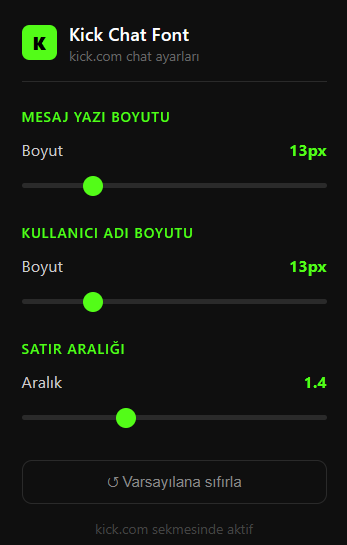

# 🟢 Kick Chat Font Modifier (Chrome Extension)

Kick.com üzerinde herhangi bir yayını izlerken, platformun kendi yapısı gereği hesap girişi yapmamış (anonim) kullanıcıların chat yazı boyutunu ve satır aralığını değiştirmesine izin verilmez.

Bu uzantı, giriş yapma zorunluluğunu ortadan kaldırarak Kick chat arayüzündeki mesaj boyutunu, kullanıcı adı boyutunu ve satır aralığını dilediğiniz gibi özelleştirmenizi sağlar. Canlı güncellemeleri destekler ve sayfa geçişlerinde (SPA navigation) ayarlarınızı korur.

 

  

 

## ✨ Özellikler

* **Giriş Yapmadan Kullanım:** Hesabınıza giriş yapmadan da chat font ayarlarına tam erişim.
* **Mesaj Boyutu Ayarı:** 10px ile 24px arasında dinamik boyutlandırma.
* **Kullanıcı Adı Boyutu Ayarı:** Kullanıcı adlarının okunabilirliğini mesajlardan bağımsız ayarlama seçeneği.
* **Satır Aralığı (Line Height):** Chat akışının yoğunluğunu belirleme imkanı.
* **Canlı Önizleme:** Popup üzerindeki slider'ları kaydırdığınız an değişiklikler sayfaya anında yansır.
* **Kalıcı Hafıza:** Ayarlarınız `chrome.storage.sync` üzerinde saklanır, tarayıcıyı kapatsanız bile silinmez.

## 🛠️ Kurulum Kılavuzu (Yerel Yükleme)

Uzantı Chrome Web Mağazası'nda yer almadığı için tarayıcınıza **Geliştirici Modu** ile kolayca ekleyebilirsiniz:

1.  Bu projeyi bilgisayarınıza indirin (ZIP olarak indirip klasöre çıkartabilir veya `git clone` kullanabilirsiniz).
2.  Google Chrome tarayıcınızı açın ve adres çubuğuna `chrome://extensions/` yazarak **Uzantılar** sayfasına gidin.
3.  Sayfanın sağ üst köşesinde bulunan **"Geliştirici modu"** (Developer mode) anahtarını aktif hale getirin.
4.  Sol üst köşede beliren **"Paketlenmemiş uzantı yükle"** (Load unpacked) butonuna tıklayın.
5.  Bilgisayarınıza indirdiğiniz ve içinde `manifest.json` dosyasının bulunduğu proje klasörünü seçin.

İşlem tamam! Artık Kick.com'a gidip uzantıyı kullanmaya başlayabilirsiniz.

## 🚀 Teknolojiler ve Yapı

Proje tamamen performans odaklı ve hafif (lightweight) olarak saf web teknolojileriyle geliştirilmiştir:

* **Manifest V3:** Güncel Chrome uzantı standartlarına tam uyullanabilirlik.
* **Content Script:** Kick.com DOM yapısını dinamik olarak izleyen ve CSS enjekte eden `content.js`.
* **MutationObserver:** Kick'in SPA (Single Page Application) yapısından kaynaklanan sayfa geçişlerinde stil kayıplarını önleyen dinamik takip mekanizması.

## 📝 Lisans

Dilediğiniz gibi geliştirebilir, çatallayabilir (fork) veya kişisel amaçlarınız için kullanabilirsiniz.
